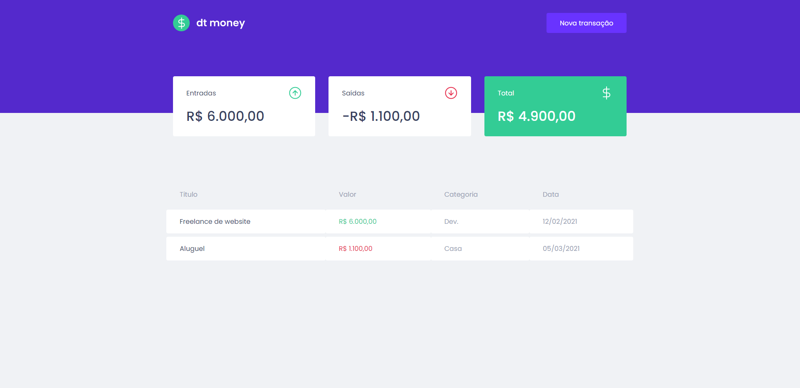

  

## 📝 Sobre
Aplicação para acompanhamentos de entradas e saídas de dinheiro realizada dentro da trilha de React.js do Ignite.

Nela podemos adicionar gastos feitos durante o mês e entradas também, mantendo o acompanhamento do seu dinheiro.

## 📸 Imagem

  

## 🔧 Tecnologias
Nesta aplicação utilizamos:
  - [React.js](https://pt-br.reactjs.org/)
  - [Typescript](https://www.typescriptlang.org/)
  - [Styled-components](https://styled-components.com/)

Utilizamos também ferramentas como:
  - [Mirage](https://miragejs.com/)
  - [react-modal](https://github.com/reactjs/react-modal)
  - [axios](https://github.com/axios/axios)
  - [polished](https://polished.js.org/)

## 👨🏽‍💻 Autor
#### Feito com 🤎 por *[Gabriel Bittencourt Penteado](https://www.linkedin.com/in/gabriel-bittencourt-penteado/)*. Entre em contato! 👋🏽